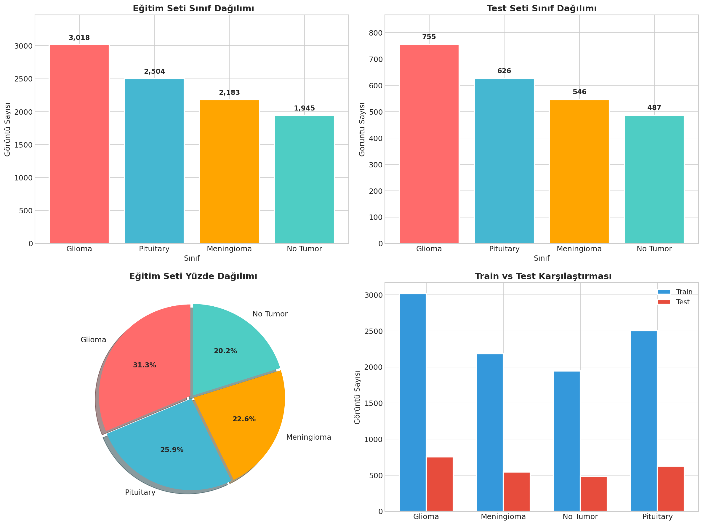
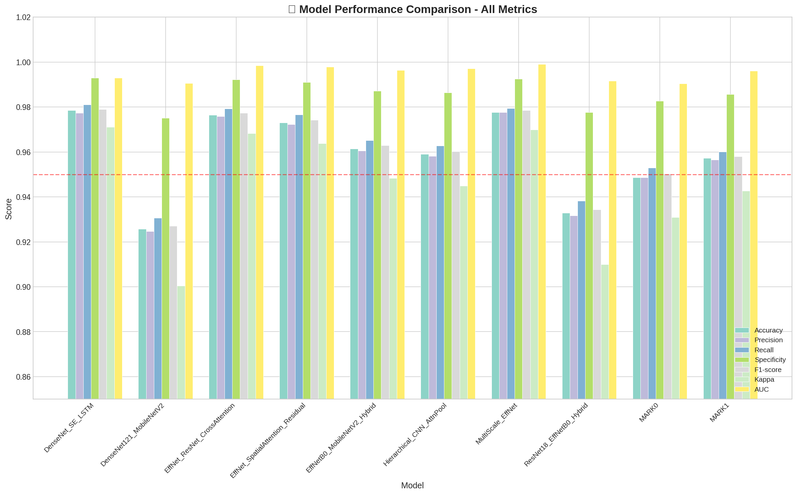
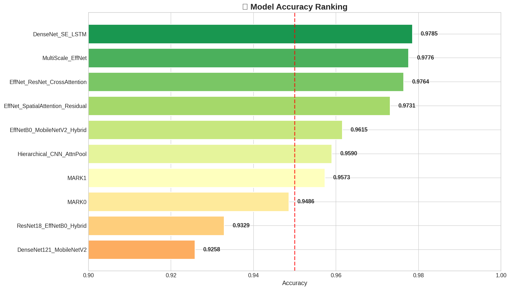
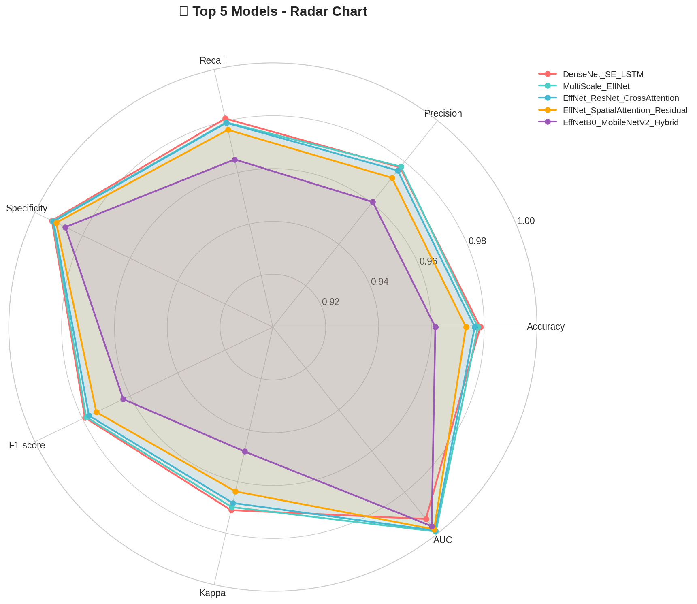
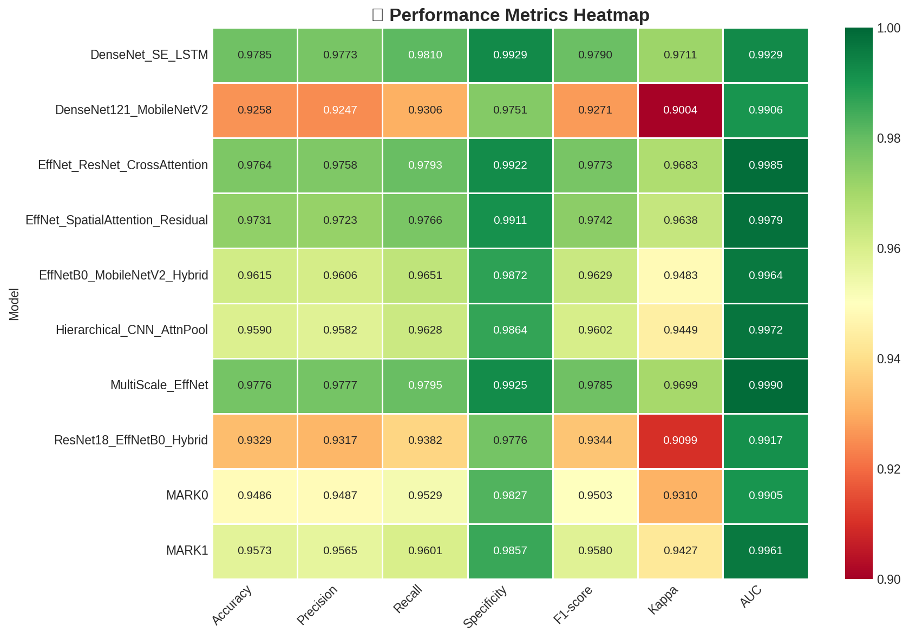

# Beyin Tümörü Sınıflandırma Projesi

MR görüntülerinden **4 sınıf** beyin tümörü sınıflandırması — PyTorch tabanlı, çoklu mimari denemeleri ve Gradio web arayüzü.

| Sınıf | Açıklama |
|-------|----------|
| Glioma | Beyin/omurilik kaynaklı tümör |
| Meningioma | Meninks kaynaklı tümör |
| No Tumor | Tümör yok |
| Pituitary | Hipofiz bezi tümörü |

---

## Model Performansları

| Model | Accuracy | Precision | Recall | F1 | Kappa | AUC |
|-------|----------|-----------|--------|----|-------|-----|
| **DenseNet_SE_LSTM** | **0.9785** | 0.9773 | 0.9810 | 0.9790 | 0.9711 | 0.9929 |
| MultiScale_EffNet | 0.9776 | 0.9777 | 0.9795 | 0.9785 | 0.9699 | 0.9990 |
| EffNet_ResNet_CrossAttention | 0.9764 | 0.9758 | 0.9793 | 0.9773 | 0.9683 | 0.9985 |
| EffNet_SpatialAttention_Residual | 0.9731 | 0.9723 | 0.9766 | 0.9742 | 0.9638 | 0.9979 |
| Hierarchical_CNN_AttnPool | 0.9590 | 0.9582 | 0.9628 | 0.9602 | 0.9449 | 0.9972 |
| EffNetB0_MobileNetV2_Hybrid | 0.9615 | 0.9606 | 0.9651 | 0.9629 | 0.9483 | 0.9964 |
| MARK1 | 0.9573 | 0.9565 | 0.9601 | 0.9580 | 0.9427 | 0.9961 |
| MARK0 | 0.9486 | 0.9487 | 0.9529 | 0.9503 | 0.9310 | 0.9905 |
| ResNet18_EffNetB0_Hybrid | 0.9329 | 0.9317 | 0.9382 | 0.9344 | 0.9099 | 0.9917 |
| DenseNet121_MobileNetV2 | 0.9258 | 0.9247 | 0.9306 | 0.9271 | 0.9004 | 0.9906 |

> `Test.py` ile inference için: **DenseNet_SE_LSTM**, **MARK0**, **MARK1** TorchScript modelleri gerekli.

---

## Proje Yapısı

```
brain_tumor/
│
├── Brain_tumor.ipynb        # Colab ortamı için genel eğitim notebook'u
├── Train.ipynb              # Yerel eğitim, değerlendirme, TorchScript export
├── EDA.ipynb                # Veri seti keşfi ve görselleştirme
├── chart.ipynb              # Modellerin karşılaştırmalı metrik grafikleri
├── Test.py                  # Gradio web arayüzü (inference)
├── model_metrics.csv        # Tüm modellerin performans metrikleri
├── proje_aciklama.pdf       # Proje açıklama belgesi
│
├── models/
│   ├── <MODEL_ADI>_<ACC>/   # Her model için: confusion_matrix, history,
│   │   ├── confusion_matrix.png   #  roc_pr_curves, metrics_table, classification_report
│   │   ├── history.png
│   │   ├── roc_pr_curves.png
│   │   ├── metrics_table.png
│   │   └── classification_report.txt
│   ├── VGG16/               # VGG16 baseline görselleri
│   └── notebooks/           # Her mimariye özel eğitim notebook'ları
│
└── image/                   # EDA ve karşılaştırma görselleri
```

---

## Görseller

### Sınıf Dağılımı


### Model Karşılaştırması


### Accuracy Sıralaması


### Radar Chart (Top 5)


### Metrik Heatmap


---

## Kurulum

```bash
python -m venv .venv
source .venv/bin/activate
pip install torch torchvision gradio numpy pandas matplotlib seaborn
# EDA için ek:
pip install opencv-python scikit-image scipy scikit-learn
```

---

## Çalıştırma

### Web Arayüzü (Inference)

```bash
python Test.py
# → http://127.0.0.1:7860
```

1. Model seçin (DenseNet_SE_LSTM / MARK0 / MARK1)
2. MR görüntüsü yükleyin
3. "Tahmin Yap" → sınıf + olasılıklar

> Model `.pt` dosyaları repo'da bulunmayabilir (boyut kısıtı). `models/<MODEL_ADI>_<ACC>/<MODEL_ADI>_jit.pt` konumuna yerleştirin.

### Eğitim

`Train.ipynb` veya `Brain_tumor.ipynb` (Colab):
- `DATASET_PATH` / `DATA_PATH` kendi dizinine göre ayarla
- Çıktılar: `models/<MODEL_ADI>_<ACC>/` altına kaydedilir
- Son adım: TorchScript export (`*_jit.pt`)

### EDA

`EDA.ipynb`:
- Sınıf dağılımı, görüntü boyutları, piksel istatistikleri
- Edge detection (Canny), texture (LBP, GLCM)
- Görseller `image/` klasörüne kaydedilir

### Metrik Grafikleri

```bash
jupyter notebook chart.ipynb
# model_metrics.csv'den okur
```
Bar chart, heatmap, radar, scatter, parallel coordinates grafikleri → `image/` altına kaydedilir.

---

## Mimari Notlar

- **DenseNet_SE_LSTM**: DenseNet backbone + Squeeze-Excitation + LSTM temporal modülü
- **MultiScale_EffNet**: EfficientNet çok-ölçekli özellik füzyonu
- **EffNet_ResNet_CrossAttention**: EfficientNet + ResNet çapraz dikkat mekanizması
- **EffNet_SpatialAttention_Residual**: Spatial attention + residual bağlantılar
- **Hierarchical_CNN_AttnPool**: Hiyerarşik CNN + attention pooling
- **MARK0/MARK1**: EfficientNetB0 + MobileNetV2 hibrit ensemble

---

## Troubleshooting

| Sorun | Çözüm |
|-------|-------|
| Dataset path hatası | `DATASET_PATH` / `DATA_PATH` değerini güncelle |
| Model dosyası bulunamadı | `models/<AD>_<ACC>/<AD>_jit.pt` yolunu kontrol et |
| CUDA yok | Otomatik CPU'ya düşer, eğitim süresi artar |
| Normalization tutarsızlığı | `Train.ipynb` ve `Test.py` normalize değerleri `[0.485, 0.456, 0.406]` / `[0.229, 0.224, 0.225]` olmalı |

---

## Lisans

Eğitim/ödev amaçlıdır. Kullanılan veri seti ve model ağırlıkları için ilgili kaynakların lisans koşullarını kontrol edin.
